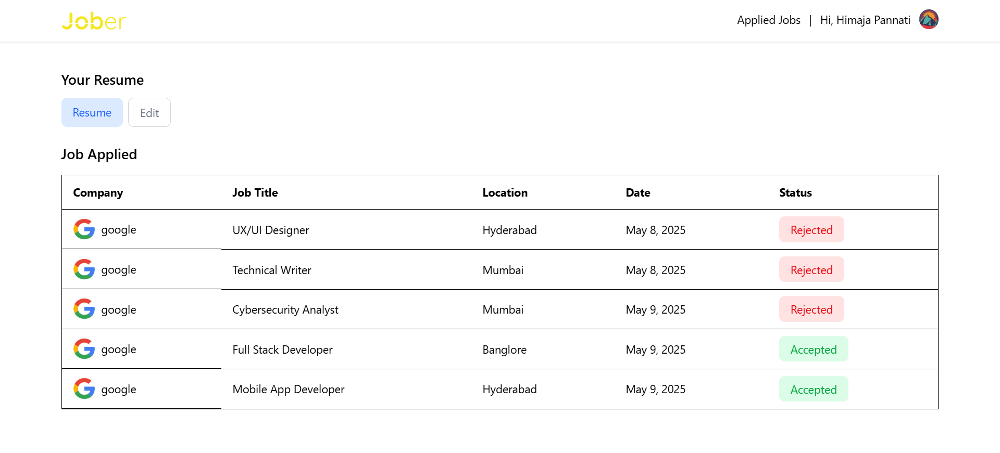

# Jober – Job Portal 👩‍💼👨‍💼

A full-stack job portal that seamlessly connects recruiters with job seekers. Built with modern web technologies, Jober provides an intuitive platform for posting jobs, applying to roles, managing candidates, and streamlining hiring workflows.

---

## 🚀 Live Demo

🔗 [Click here to view the app](https://jober-job-portal-client.vercel.app/)

---

## 📌 Features

### 👤 User Portal (Job Seeker)
- Register/Login (via Clerk)
- View all jobs with smart filters (role, location, etc.)
- Upload resume (stored via Cloudinary)
- View previously applied jobs
- One-click application system

### 🧑‍💼 Recruiter Portal
- Secure recruiter login/logout
- Post new job listings (powered by Quill rich text editor)
- Toggle job visibility (active/inactive)
- View all posted jobs
- View applicant details:
  - Candidate name
  - Resume link
  - Applied job title
  - Option to accept applications

---

## 🛠️ Tech Stack

| Layer        | Tech Used                          |
|--------------|------------------------------------|
| Frontend     | React.js + Tailwind CSS            |
| Backend      | Node.js + Express.js               |
| Authentication | Clerk (with Webhooks)            |
| Database     | MongoDB (Mongoose ODM)             |
| File Storage | Cloudinary (for resume uploads)    |
| Rich Editor  | Quill.js                           |
| Auth Token   | JSON Web Token (JWT)               |
| Hosting      | Vercel (for both client & server)  |

---

## 🔐 Authentication

- Clerk handles user authentication for both job seekers and recruiters.
- Session-based routing and role-based access control.
- Webhooks integrated via Clerk to react to user auth events.

---

## 📸 Screenshots

### 🖼️ Homepage – Job Listings

### 🧾 Applied Jobs

